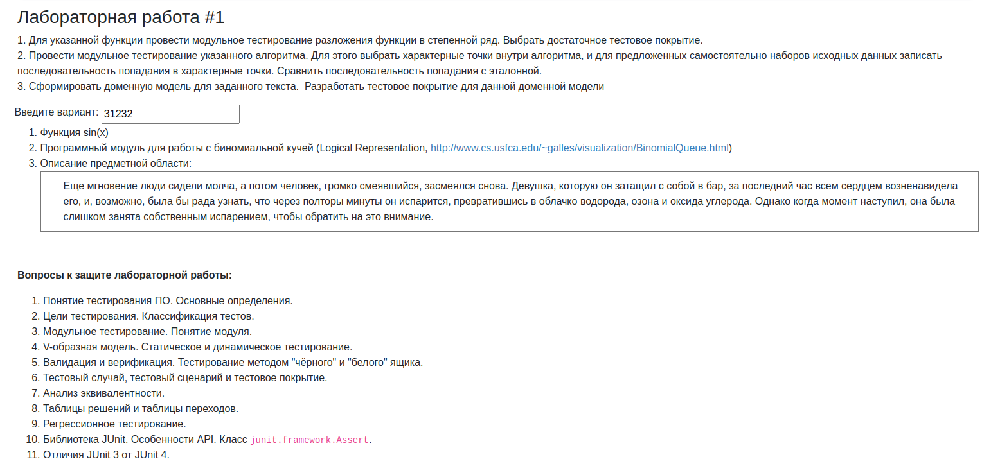

https://www.cs.usfca.edu/~galles/visualization/BinomialQueue.html
https://se.ifmo.ru/~nnaumova/

ТПО
- Все лабораторные должны быть выполнены на helios.

ЛР1
- Используем JUnit 5
- Не забываем убедиться в 100% code coverage для всех пунктов задания
- Для тестирования мат. функции пользуемся параметризованными тестами
- Добавьте UML к доменной модели (п.3) в отчет
- Модель из п.3 не выводит текст в консоль, как на ЛР3 по программированию. Задача -- сделать модель с состояниями, и оперировать этими состояниями при составлении тестов. Если не хватает сущностей из исходного текста, текст можно расширить
